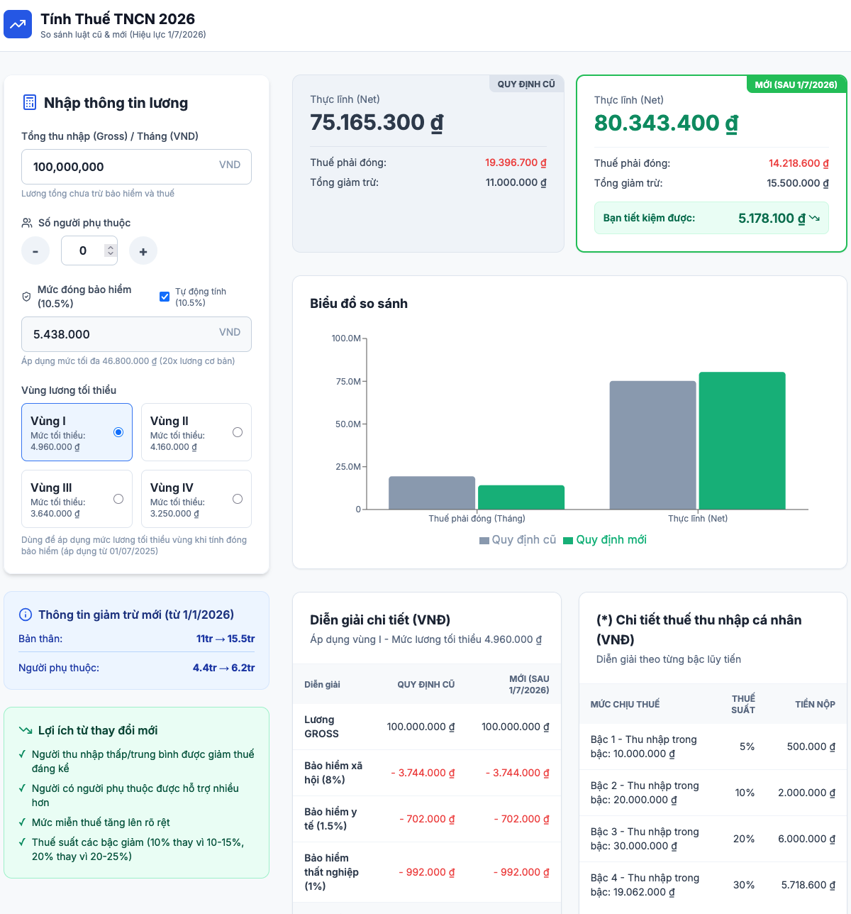

# Vietnam Tax Calculator 2025

A Vietnam Personal Income Tax Calculator comparing the old and new tax laws (effective July 1, 2025).

🌐 **Live Demo**: https://vietvudanh.github.io/vietnam-tax-2025/

View your app in AI Studio: https://ai.studio/apps/drive/1Ow3bKeIIdlrhBjB5_CFfT1H3qBXF1xsn

## Project Purpose

- Cho phép nhập lương, người phụ thuộc và vùng lương tối thiểu để tự động tính bảo hiểm, thuế TNCN.
- So sánh nhanh thu nhập thực lĩnh giữa quy định cũ và mới (hiệu lực 01/07/2025), kèm diễn giải chi tiết.
- Trình bày bảng thuế lũy tiến, giảm trừ gia cảnh và các khoản đóng bảo hiểm cho người lao động và doanh nghiệp.

## Screenshot

## Run Locally

**Prerequisites:**  Node.js

1. Install dependencies:
   `npm install`
2. Run the app:
   `npm run dev`
