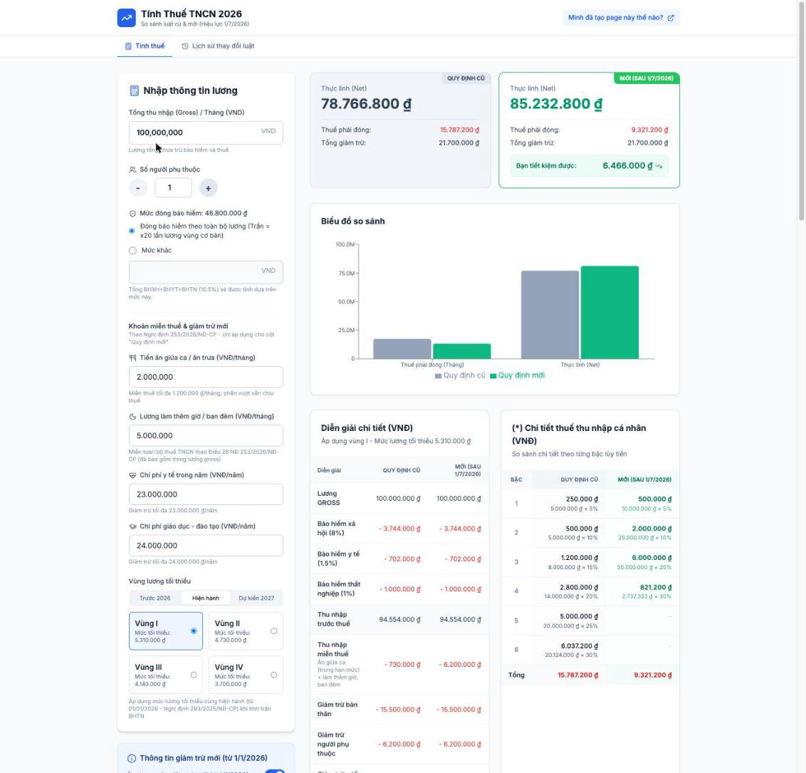

# 🇻🇳 Vietnam Tax Calculator 2026

**Công cụ tính thuế Thu nhập Cá nhân Việt Nam - So sánh luật thuế cũ và mới**

[](https://vietvudanh.github.io/vietnam-tax-2025/)
[](https://github.com/vietvudanh/vietnam-tax-2025)
[](https://react.dev/)
[](https://www.typescriptlang.org/)
[](https://vitejs.dev/)

---

## 📖 About | Giới thiệu

A comprehensive **Vietnam Personal Income Tax (PIT) Calculator** that compares tax calculations between the old tax law and the new law — **Luật Thuế TNCN 2025 (109/2025/QH15)** together with **Nghị định 253/2026/NĐ-CP**, effective **July 1, 2026**.

Công cụ tính **Thuế Thu nhập Cá nhân (TNCN) Việt Nam** toàn diện, so sánh thuế giữa quy định cũ và quy định mới theo **Luật Thuế TNCN 2025** và **Nghị định 253/2026/NĐ-CP**, hiệu lực từ **01/07/2026**.

---

## ✨ Features | Tính năng

| Feature | Tính năng |
|---------|-----------|
| 💰 **Income Input** | Nhập lương, số người phụ thuộc và vùng lương tối thiểu |
| 🔄 **Auto Calculation** | Tự động tính bảo hiểm xã hội, bảo hiểm y tế, thuế TNCN |
| 📊 **Side-by-Side Comparison** | So sánh song song thu nhập thực lĩnh giữa luật cũ và mới |
| 📈 **Progressive Tax Brackets** | Hiển thị bảng thuế lũy tiến chi tiết |
| 👨‍👩‍👧‍👦 **Dependent Deductions** | Tính giảm trừ gia cảnh cho người phụ thuộc |
| 🏢 **Employer/Employee Breakdown** | Phân tích các khoản đóng bảo hiểm cho cả người lao động và doanh nghiệp |
| 🍱 **Meal Allowance Exemption** | Miễn thuế tiền ăn giữa ca đến 1,2 triệu đồng/tháng (NĐ 253/2026/NĐ-CP) |
| 🌙 **Overtime Exemption** | Miễn thuế toàn bộ tiền lương làm thêm giờ, làm ban đêm |
| 🏥 **Medical & Education Deductions** | Giảm trừ chi phí y tế (23tr/năm) và giáo dục - đào tạo (24tr/năm) |
| 🕘 **Law Changelog Tab** | Tab riêng ghi lại lịch sử thay đổi luật thuế TNCN từ Luật 2007 đến nay, có link toàn văn trên Thư Viện Pháp Luật |
| 📅 **Minimum Wage Sets** | Chọn giữa mức lương tối thiểu vùng trước 2026, hiện hành (NĐ 293/2025) và dự kiến 2027 (dự thảo); mặc định tự chọn theo ngày truy cập |
| 🗓️ **Annual Finalization** | Tab "Quyết toán thuế năm": nhập lương tháng + số tháng làm việc + các khoản thưởng một lần, tính thuế cả năm theo biểu thuế năm. Dùng chung dữ liệu nhập với tab theo tháng nên chuyển tab không mất thông tin |
| 💸 **Tax Refund / Top-up** | So sánh thuế đã tạm khấu trừ 12 tháng với thuế quyết toán để ra số tiền **được hoàn** hoặc **phải nộp thêm** |
| 📆 **Monthly Withholding Table** | Bảng chi tiết 12 tháng, tự đánh dấu tháng bị tạm khấu trừ cao bất thường (thưởng Tết, lương tháng 13) |
| ↔️ **Net/Gross Converter** | Tab "Quy đổi Net/Gross": quy đổi hai chiều Gross → Net và Net → Gross, hiển thị song song theo quy định cũ và mới |

---

## 📸 Screenshots

**Tab "Tính thuế"** - nhập lương, các khoản miễn thuế mới và xem so sánh chi tiết:

<div align="center">
  
</div>

**Tab "Lịch sử thay đổi luật"** - dòng thời gian các mốc thay đổi thuế TNCN từ Luật 2007:

<div align="center">
  
</div>

---

## 🚀 Quick Start | Bắt đầu nhanh

### Prerequisites | Yêu cầu

- [Node.js](https://nodejs.org/) (v18 or higher recommended)

### Installation | Cài đặt

```bash
# Clone the repository
git clone https://github.com/vietvudanh/vietnam-tax-2025.git
cd vietnam-tax-2025

# Install dependencies
npm install

# Start development server
npm run dev
```

The app will be available at `http://localhost:5173`

### Production Build

```bash
# Build for production
npm run build

# Preview production build
npm run preview
```

---

## 🛠️ Tech Stack

| Technology | Purpose |
|------------|---------|
| **React 19** | UI Framework |
| **TypeScript 7** | Type Safety (native Go compiler) |
| **Vite 6** | Build Tool & Dev Server |
| **Recharts** | Charts & Data Visualization |
| **Lucide React** | Icons |
| **Tailwind CSS** | Styling |

---

## 📁 Project Structure

```
vietnam-tax-2025/
├── 📄 App.tsx              # Main application component
├── 📂 components/          # React components
│   ├── AnnualSummary.tsx   # Annual finalization: refund / top-up card + year totals
│   ├── BracketTable.tsx    # Tax bracket display
│   ├── ComparisonChart.tsx # Old vs New comparison chart
│   ├── DeductionDetailTable.tsx # Deduction breakdown
│   ├── InputForm.tsx       # Salary + exemption input form
│   ├── LawChangelog.tsx    # Law changelog timeline (tab 2)
│   ├── MonthlyBreakdownTable.tsx # 12-month withholding table
│   ├── NetGrossConverter.tsx # Gross ↔ Net converter tab
│   └── TaxReductionChart.tsx # Gross salary vs tax reduction chart
├── 📂 utils/               # Utility functions
├── 📄 types.ts             # TypeScript type definitions
├── 📂 assets/              # Images and static assets
└── 📂 public/              # Public static files
```

---

## 📚 Tax Law Reference | Tham khảo Luật Thuế

The calculator implements two rule sets side by side:

| | Quy định cũ | Quy định mới (từ 1/7/2026) |
|---|---|---|
| Biểu thuế lũy tiến | 7 bậc (5% - 35%) | 5 bậc (5%, 10%, 20%, 30%, 35%) |
| Giảm trừ bản thân | 11.000.000 ₫/tháng | 15.500.000 ₫/tháng |
| Giảm trừ người phụ thuộc | 4.400.000 ₫/tháng | 6.200.000 ₫/tháng |
| Tiền ăn giữa ca miễn thuế | 730.000 ₫/tháng | 1.200.000 ₫/tháng |
| Lương làm thêm giờ, ban đêm | Chỉ miễn phần chênh lệch | Miễn toàn bộ |
| Giảm trừ chi phí y tế | Không có | Tối đa 23.000.000 ₫/năm |
| Giảm trừ chi phí giáo dục | Không có | Tối đa 24.000.000 ₫/năm |
| Ngưỡng thu nhập người phụ thuộc | 1.000.000 ₫/tháng | 3.000.000 ₫/tháng |

**Căn cứ pháp lý chính:**

- [Luật Thuế thu nhập cá nhân 2025 (Luật 109/2025/QH15)](https://thuvienphapluat.vn/van-ban/Thue-Phi-Le-Phi/Luat-Thue-thu-nhap-ca-nhan-2025-so-109-2025-QH15-665870.aspx) - hiệu lực 01/7/2026
- [Nghị định 253/2026/NĐ-CP](https://thuvienphapluat.vn/van-ban/Thue-Phi-Le-Phi/Nghi-dinh-253-2026-ND-CP-huong-dan-Luat-Thue-thu-nhap-ca-nhan-699193.aspx) - hướng dẫn chi tiết Luật Thuế TNCN 2025
- [Thông tư 87/2026/TT-BTC](https://thuvienphapluat.vn/van-ban/Thue-Phi-Le-Phi/Thong-tu-87-2026-TT-BTC-huong-dan-Luat-Thue-thu-nhap-ca-nhan-Nghi-dinh-253-2026-ND-CP-713265.aspx) - ngưỡng thu nhập xác định người phụ thuộc (3 triệu đồng/tháng)
- [Nghị quyết 110/2025/UBTVQH15](https://thuvienphapluat.vn/van-ban/Thue-Phi-Le-Phi/Nghi-quyet-110-2025-UBTVQH15-muc-giam-tru-gia-canh-thue-thu-nhap-ca-nhan-665865.aspx) - mức giảm trừ gia cảnh áp dụng từ kỳ tính thuế 2026
- [Nghị định 293/2025/NĐ-CP](https://thuvienphapluat.vn/van-ban/Lao-dong-Tien-luong/Nghi-dinh-293-2025-ND-CP-quy-dinh-muc-luong-toi-thieu-lao-dong-lam-viec-theo-hop-dong-lao-dong-665866.aspx) - lương tối thiểu vùng từ 01/01/2026
- [Dự thảo Nghị định lương tối thiểu vùng 2027](https://thuvienphapluat.vn/lao-dong-tien-luong/da-co-bang-luong-toi-thieu-vung-moi-tu-01012027-cho-toan-bo-nguoi-lao-dong-34-tinh-thanh-theo-du-ki-63150.html) - Bộ Nội vụ công bố 20/7/2026, **chưa ban hành chính thức**

Xem đầy đủ dòng thời gian thay đổi luật trong tab **"Lịch sử thay đổi luật"** của ứng dụng.

> ⚠️ Kết quả mang tính tham khảo, không thay thế tư vấn thuế chính thức.

---

## 🤝 Contributing | Đóng góp

Contributions are welcome! Feel free to:

1. Fork the repository
2. Create a feature branch (`git checkout -b feature/amazing-feature`)
3. Commit your changes (`git commit -m 'Add amazing feature'`)
4. Push to the branch (`git push origin feature/amazing-feature`)
5. Open a Pull Request

---

## 📝 Blog Post

📖 **Read about how this was built**: [Mình đã tạo page này thế nào?](https://vietvudanh.substack.com/p/minh-a-tao-trang-tinh-thue-tncn-2026)

---

## 👤 Author

<div align="center">
  
  **Viet Vu Danh**
  
  [](https://github.com/vietvudanh)
  [](https://vietvudanh.substack.com/)

</div>

---

## 📄 License

This project is open source and available under the [MIT License](LICENSE).

---

<div align="center">
  
  ⭐ **Star this repo if you find it useful!** ⭐
  
  Made with ❤️ in Vietnam 🇻🇳
  
</div>
